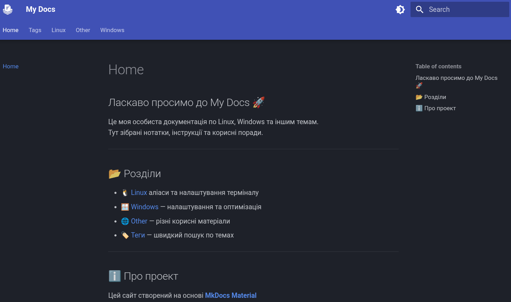

## Ласкаво просимо до My Docs 🚀

Це моя особиста документація по Linux, Windows та іншим темам.  
Тут зібрані нотатки, інструкції та корисні поради.  

---

## 📂 Розділи

<a href="https://silmarill07.github.io/docs/Linux/Alials/" target="_blank">🐧 Linux</a> — аліаси та налаштування терміналу 
<a href="https://silmarill07.github.io/docs/Windows/%D0%92%D0%B8%D0%B4%D0%B0%D0%BB%D0%B5%D0%BD%D0%BD%D1%8F%20%D0%B7%D0%B0%D0%B9%D0%B2%D0%B8%D1%85%20%D0%B7%D0%B0%D0%B2%D0%B0%D0%BD%D1%82%D0%B0%D0%B6%D1%83%D0%B2%D0%B0%D1%87%D1%96%D0%B2%20Linux/" target="_blank">🪟 Windows</a> — налаштування та оптимізація 
<a href="https://silmarill07.github.io/docs/Other/Service-Worker/" target="_blank">🌐 Other</a> — різні корисні матеріали 
<a href="https://silmarill07.github.io/docs/tags/" target="_blank">🏷️ Теги</a> — швидкий пошук по темах

---

## ℹ️ Про проект

Цей сайт створений на основі **[MkDocs Material](https://squidfunk.github.io/mkdocs-material/)**  

---

